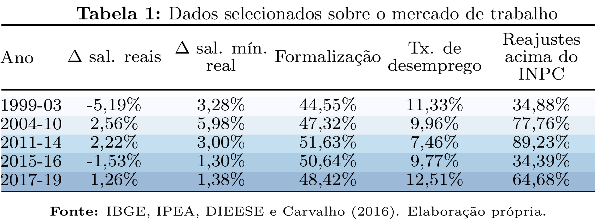

<style>
pre {
  font-size: 14px;
}
</style>

```{r setup, include=FALSE, echo = F}
# library(shiny)
library(ggplot2)
library(plotly)
library(plyr)
# library(flexdashboard)
setwd("~/Doutorado/PED - CE342/Aulas/Macro/Slides_Aula_Macro")

source('Pacotes.R', verbose = F)
source('Graficos_Aula_Macro.R', verbose = F)
```


## Sumário

- Introdução

- Conjuntura Macroeconômica (1999-2021)

  - Período I (1999-2003)

  - Período II (2004-2010)

  - Período III (2011-2014)

  - Período IV (2015-2016)

  - Período V (2017-2019)

  - Período VI (2020-2021)
  
- Conclusão


<!----------------------------------------------------------------------------->
<!----------------                                      ----------------------->
<!----------------                GŔAFICOS              ----------------------->
<!----------------                                      ----------------------->
<!----------------------------------------------------------------------------->

Introdução
=======================================================================

## Introdução

- Panorâma geral da conjuntura macroeconômica do Brasil entre 1999 e 2021

- Antecedentes

  - Plano Real (1994) e primeiro governo FHC (1994-1999)
    - Estabilização da inflação
    - Acúmulo de reservas internacionais 
    - Reformas liberalizantes
    
  - Crises nos países emergentes
    - México (1995), Sudeste Asiático (1997-1998), Russa (1998)
    - Ataques especulativos
    
  - Adoção do regime de câmbio flutuante (1999)
  
  - Adoção do RMI (1999)


## Introdução {.smaller .build}

- De acordo com o arcabouço teórico do NCM e do RMI brasileiro, quais variáveis o Banco Central brasileiro (BCB) acompanha e monitora para guiar suas decisões da política monetária?

  - Inflação
    - **Nível e tendência**, desvios da meta e expectativas.
  
  - Demanda agregada
    - **Hiato do produto**
    - Mercado de trabalho
    - Mercado de crédito
    
  - Ambiente externo
    - **Taxa de câmbio**
    - Preços de ***commodities***
    - Comércio exterior e reservas internacionais
  
  - Mercado monetário
  
- Choques: transitórios ou persistentes?
  
## Conjuntura Macroeconômica (1999-2021)

- <font size="4"> Períodos de aceleração e de estabilização inflacionária </font>

- <font size="4"> Principais determinantes da inflação no período </font>

  - <font size="3"> Importância da taxa de câmbio: como fator acelerador (atenuante) da inflação (ARAUJO; MODENESI, 2010; SERRANO; SUMMA, 2015) e canal de transmissão (SERRANO, 2010) </font>
    - <font size="3"> Preços monitorados (até 2006) e bens tradables (especialmente, do grupo de Alimentação e Bebidas) </font>
    
  - <font size="3"> Importância dos preços de commodities </font>
    - <font size="3"> Relação significativa com a taxa de câmbio (STOCKL; MOREIRA; GIUBERTI, 2017) </font>
  
  - <font size="3"> Menor relevância da demanda agregada (ARAÚJO; MODENESI, 2010; BRAGA, 2013) </font>
    - <font size="3"> Maior influência sobre o mercado de trabalho e sobre a inflação de serviços (SUMMA; SERRANO, 2018). </font>

## Conjuntura Macroeconômica (1999-2021) 

- E como o Regime de Metas da Inflação lidou com a inflação nesse período? 

  - Altas taxas de juros nominais até 2011 (MODENESI, 2012; BARBOZA, 2015)

- A partir de 2011, há uma tentativa de alterar a dinâmica da política monetária.

  - Encontra dificuldades em virtude de maiores pressões inflacionárias.

- Após a crise de 2015 e lenta recuperação econômica, observou-se uma tendência de redução do patamar da taxa de juros nominal.

- Reversão em 2021 com a recente escalada da inflação.

Análise dos períodos
=======================================================================

## Período I (1999-2003)

- Trata-se de um período marcado por inflação relativamente alta, processo de desvalorização cambial e altas taxas de juros nominais. 

  - Descumprimento da meta nos anos de 2001, 2002 e 2003. 

- Principais determinates da inflação:
  - Inflação de preços monitorados 
    - Desvalorização cambial em 1999
    - Crise energética nos anos 2001
    - Turbulência política e forte desvalorização cambial em 2002
  
  - Bens tradables
    - Desvalorização cambial e preços de *commodities* (em menor medida)

## Gráficos - Período I (1999-2003) {.smaller}

```{r, fig.align='center', echo = FALSE}
p_metas
p_IPCA_BCB
p_juros_cambio

```

## Período II (2004-2010)

- Características do período:
  - Inflação mais baixa e estável, oscilando sobre a meta
  - Processo de valorização cambial
  - Patamar de crescimento econômico mais elevado
  - Contínuo aquecimento do mercado de trabalho, estimulado pelas políticas sociais
  - Manutenção das altas taxas de juros nominais - isto é, elevados juros reais. 

- Principais determinates da inflação:
  - Fatores altistas
    - Aquecimento do mercado de trabalho
      - Inflação de serviços e de semiduráveis
    - Ciclo de commodities
      - Gêneros alimentícios
      
  - Fatores baixistas
    - Valorização cambial
      - Auxilia no controle dos bens tradables
    - Preços de bens duráveis
      - Produtividade

## Gráficos - Período I (1999-2003) {.smaller}

```{r, fig.align='center', echo = FALSE}
p_metas
p_IPCA_BCB
p_juros_cambio

```

<!-- Mercado de trabalho {data-navmenu="Gráficos e tabela"} -->
<!-- ======================================================================= -->

<!-- Row -->
<!-- ----------------------------------------------------------------------- -->
<!-- ### Mercado de Trabalho -->

<!-- ```{r circos, fig.align='center', fig.width = 2, fig.height = 1} -->
<!--  -->
<!-- ``` -->